# React-Native-Shop-App
React native final project

## Shop-App is an app for our final project in React Native course
Application screens by order and the action behind them.

### 1st Screen Of The App
in this section we can see the categories we have in the shop

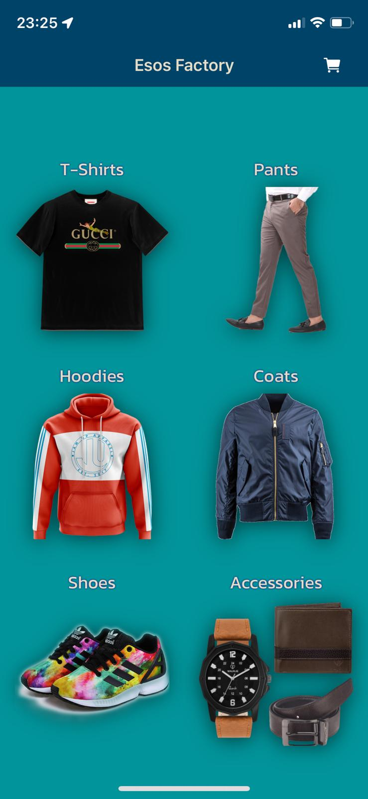

### 2nd Screen Of The App
after the user pressed on the category he wants he can see the items, the amount of the items and the price in that category

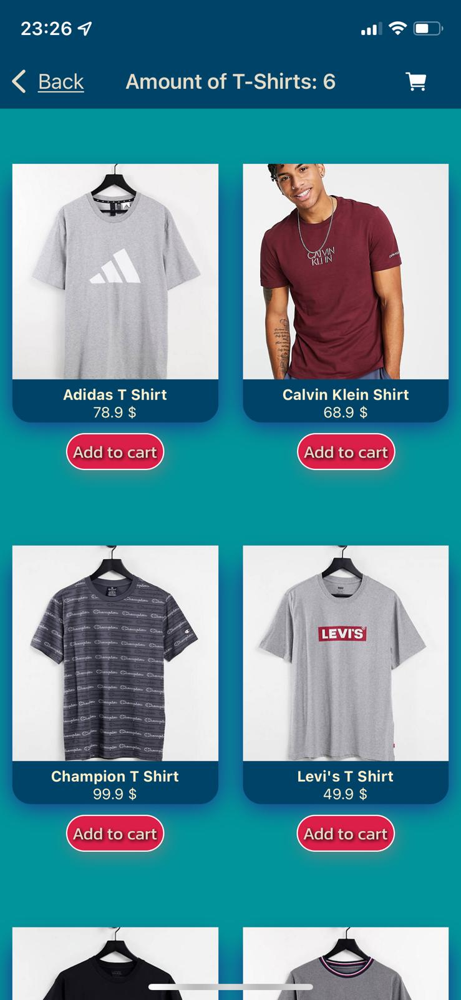

### 3rd Screen Of The App
here you see the Joggers and the Jeans category after the user choose to press on it

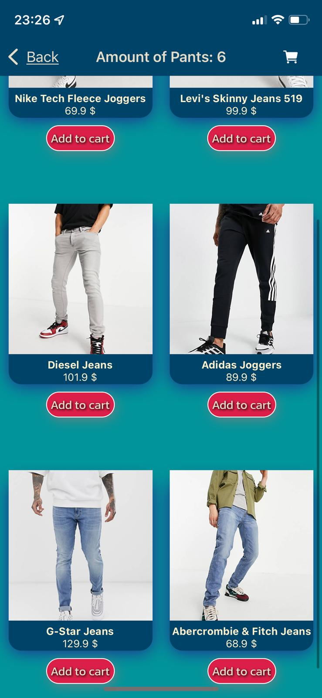

### 4th Screen Of The App
in this section we have the Sneakers category that displays the product image and price

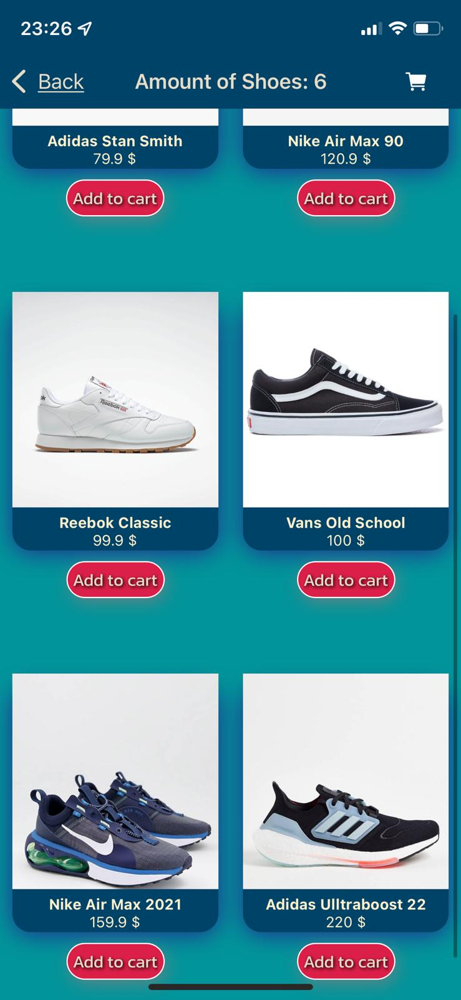

### 5th Screen Of The App
after the user choose the sneakers he likes and preesed the 'Add to cart' button a pop up button displayed with the message 'Added!'

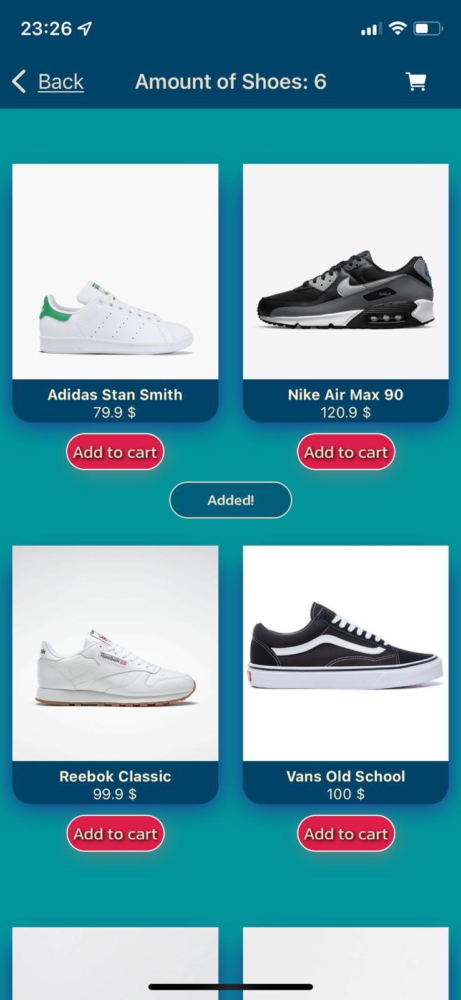

### 6th Screen Of The App
If the user taps on the product image inside the category for example the Adidas Stan Smith sneakers
It moves the user to a new window with more information about the product such as shipping price, description, sizes and the product rating

### 7th Screen Of The App
After the user choose to buy the product a pop up will apear with the text 'Added!' and a confirmation 'Product Was Added To Cart'
Also there are two buttons the first one 'Move to cart' is a button that if the user press on it it will take him to the cart window
The second button 'Continue Shopping' will let the user stay in the same windows he was for more shopping

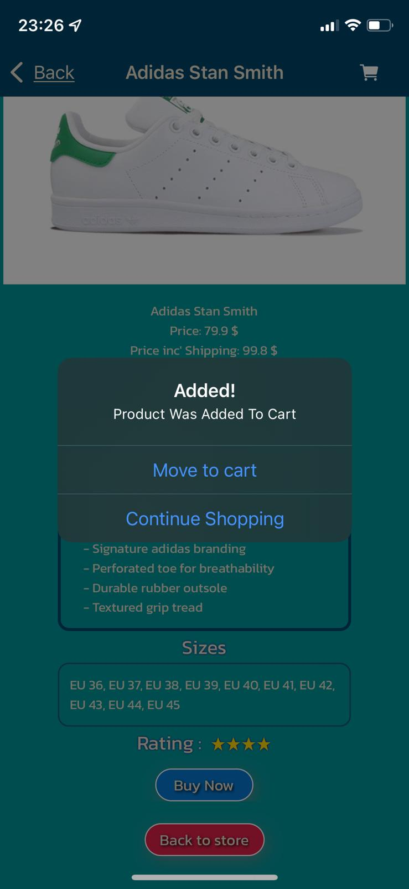

### 8th Screen Of The App
In this screen we can see the cart window if the user haven't choose any products it will display an empty page

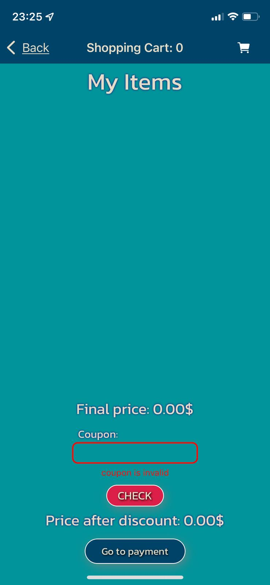

### 9th Screen Of The App
If the user choose a couple of products it will apear in the cart section and it will let know the user the total price of the products he choose
Also there's a Coupon section that will give a discount to the user if he enters a coupon code

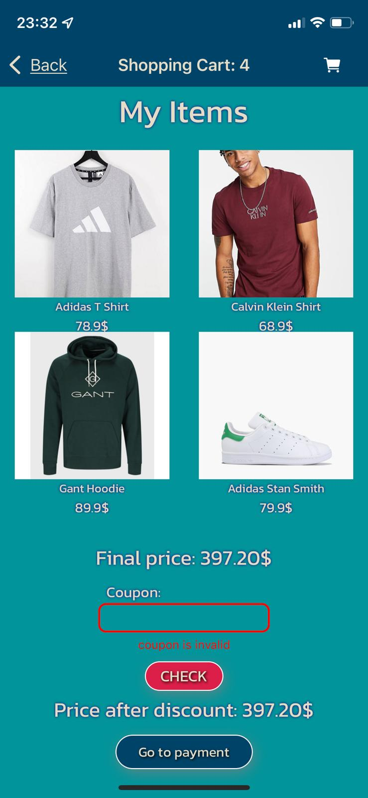

### 10th Screen Of The App
For example as you can see the final price for all the producs is 397.20 $
If the user will enter a coupon code such as 'il17' he'll get a 17 precent discount and the price will be 329.68 $

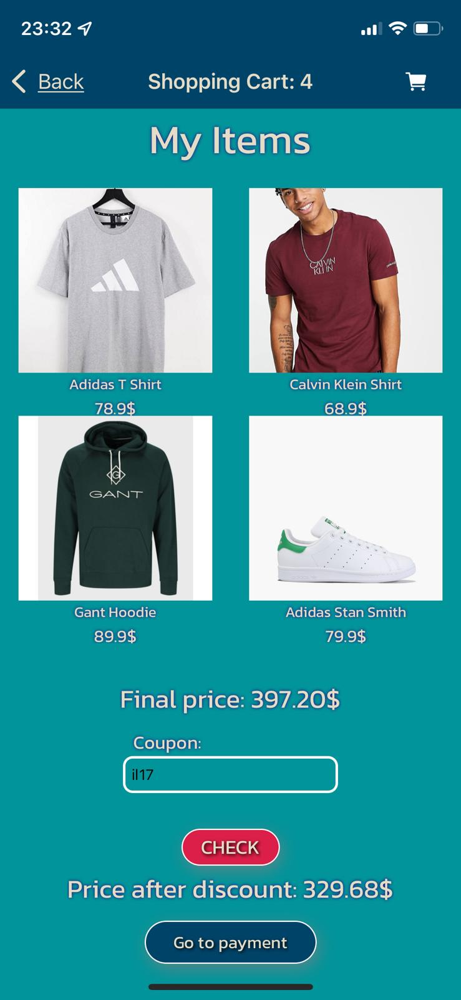

### 11th Screen Of The App
After the user press the 'Go to payment' button in screen 10 it will take him to the payment page
As you can see the page have a certain sections that the user most fill such as first name, last name, email etc...

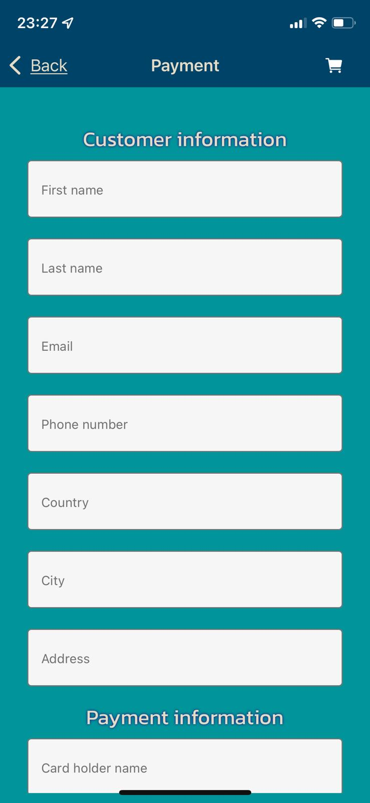

### 12th Screen Of The App
In this screen we can see that the user filled the blanks correct and also the payment information

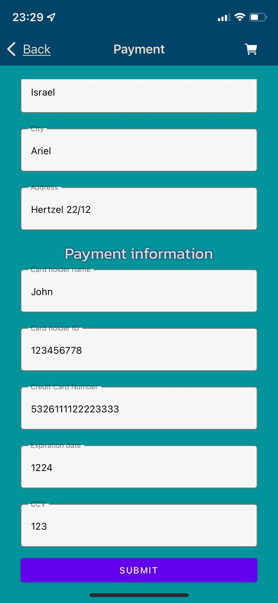

### 13th Screen Of The App
If the user will fill a false information the blanks will apear in red and won't let the user submit the information untill he fix it

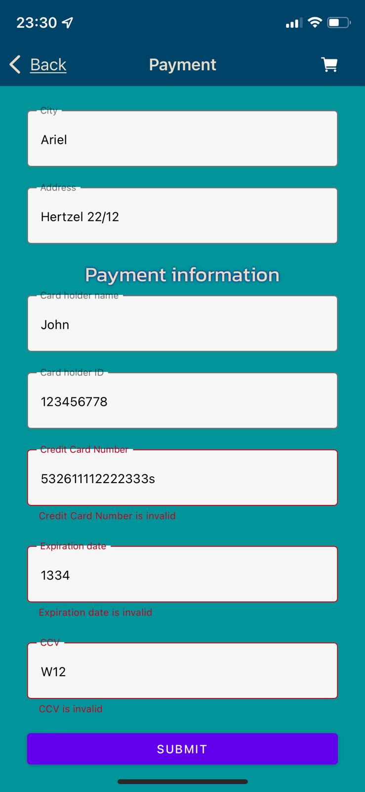

### 14th Screen Of The App
After the user submits the information asked from him the system will check If Its all correct and will move the user to the last window
As you can see after that a confirmation message will apear with the text 'You're Order is Complete!'
And it will let the user know where the products will be shipped and how long will It take 
Another option that the user will have is to get back to the store to continue browsing the shop

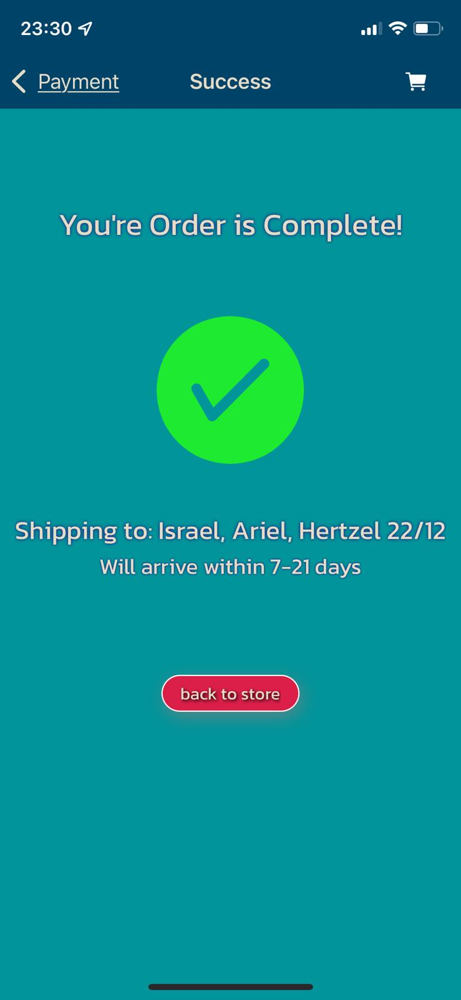
