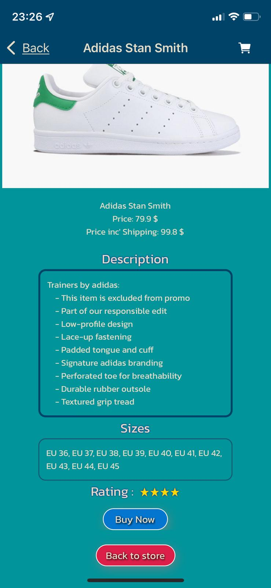

# React-Native-Shop-App

### React native final project

All rights reserved - Daniel Ronen & Shawn Bryan.

## Shop-App is a store application for our final project in React Native course

Application screens by order and the action behind them.

## Home-Screen

In this section we can see the categories we have in the store
and a shopping cart icon in right above to move to Cart-Screen.

## Shopping-Cart-Screen

In this screen we can see our shopping cart empty because the user haven't choose any products yet.

## Category-Screen(T-shirts)

After the user pressed on the category he wants he can see the products that belong to this category.

### Category-Screen(Pants)

Every product appears with an image, title, price and button for add product to cart.

### More categories (Hoodies, Coats and Accessories)

### Category-Screen(shoes)

When the user press the button 'Add to cart' appears an alert that product was added.

## Product-Screen

If the user taps on the product image inside the category for example the Adidas Stan Smith sneakers
It moves the user to a screen with all the information about the product such as shipping price, description, sizes and the product rating.

### Pressing the 'Buy Now' button

After the user choose to buy the product a pop up will apear with the text 'Product Was Added To Cart' with two buttons,
The first one 'Move to cart' bring the user directly to the Cart-Screen
The second button 'Continue Shopping' will close the pop up and let the user continue shopping.

## Shoping-Cart-Screen

If the user choose a couple of products it will apear in the cart screen and it will let know the user the total price of the products he choose includ shipping
Also there's a Coupon section that will give a discount to the user if he enters a coupon code.

### Adding Coupon

For example as you can see the final price for all the producs is 397.20 \$
If the user will enter a coupon code such as "il17" he'll get a 17% discount and the price will be 329.68 $.

## Payment-Screen

After the user press the 'Go to payment' button in the Cart-Screen it will take him to the payment page
As you can see the page have a certain sections that the user must fill customer information such as first name, last name, email etc...
And a section of payment information.

### All fields are required and validated

In this screen we can see that the user filled the customer info and also the payment information.

### Example for the validations:

If the user will fill a false information or out of the pattern the blanks will apear in red and won't let the user submit the information untill he fix it.

## Success-Screen

After the user submits all the information will move the user to the Success-Screen
As you can see after that a confirmation message will apear with the text 'You're Order is Complete!' with the destination of the order
And the duration of the shipping

Finally a button to get back to store and continue shopping.

